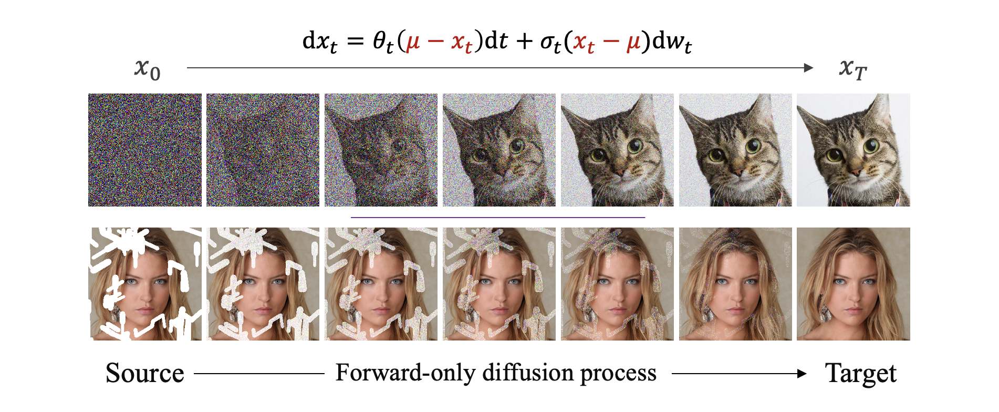

## Forward-only Diffusion Probabilistic Models (FoD)<br><sub>Official PyTorch Implementation



## How to Run the Code?

### Dependencies

* OS: Ubuntu 20.04
* nvidia:
	- cuda: 11.4
* python 3.8

### Install

We advise you first create a virtual environment with:

```bash
python3 -m venv .env
source .env/bin/activate
pip install -U pip
pip install -r requirements.txt

```


### Image Restoration
Here we provide an example for **image deraining** task, but can be changed to any problem by replacing the dataset.

#### Dataset Preparation

Download [training](http://www.icst.pku.edu.cn/struct/att/RainTrainH.zip) and [testing](http://www.icst.pku.edu.cn/struct/att/Rain100H.zip) datasets and process it in a way such that rain images and no-rain images are in separately directories, as

```bash
#### for training dataset ####
datasets/rain/trainH/GT
datasets/rain/trainH/LQ

#### for testing dataset ####
datasets/rain/testH/GT
datasets/rain/testH/LQ

```

Then get into the `image_restoration` directory and modify the dataset paths in `train_IR.py` and `sample_IR.py`. You can also change the *run-name* and *task-name* to save models in different directories.

#### Train
The core algorithms for FoD is in `image_restoration/diffusion/fod_diffusion.py`.

You can train the model for image restoration following below bash scripts:

```bash
cd image_restoration

# For single GPU:
torchrun --nnodes=1 --nproc_per_node=1 --master_port=34567 train_IR.py --global-batch-size 16

# Change the nproc_per_node and global-batch-size for multi-GPU training
torchrun --nnodes=1 --nproc_per_node=4 --master_port=34567 train_IR.py --global-batch-size 64
```

Then the models and training logs will save in `results/{task-name}`.

#### Evaluation
To evaluate our method, please modify the benchmark path and model path and run

```bash
python sample_IR.py
```


### Unconditional Generation

**Train:**
Similar to the Image Restoration task, you can train the model on CIFAR-10 following below bash script:

```bash
cd image_generation

# For single GPU:
torchrun --nnodes=1 --nproc_per_node=1 --master_port=34567 train_cifar10.py --global-batch-size 128

# Change the nproc_per_node and global-batch-size for multi-GPU training
torchrun --nnodes=1 --nproc_per_node=4 --master_port=34567 train_cifar10.py --global-batch-size 128
```
**Sampling:** You need to first change the pretrained model path and sample images with the `sample_cifar10.py`:

```bash
python sample_cifar10.py
```

#### Evaluation
We include a `ddp_sample_cifar10.py` script which samples a large number of images from a pretrain FoD model in parallel. Run:

```bash
torchrun --nnodes=1 --nproc_per_node=1 --master_port=45678 ddp_sample_cifar10.py
```
To calculate FID, Inception Score, etc., you need to obtain a *cifar_train.npz* of cifar10, and run:

```bash
python scripts/evaluator.py cifar_train.npz samples/cifar10/U-Net-0500000-seed-0.npz
```

### Results


<details>
<summary><strong>FoD forward diffusion process</strong> (click to expand) </summary>


</details>

<details>
<summary><strong>Image Restoration Results</strong> (click to expand) </summary>


</details>

---

**Acknowledgment:** Our FoD is based on [DiT](https://github.com/facebookresearch/DiT) and [guided-diffusion
](https://github.com/openai/guided-diffusion). Thanks for their code!

#### Contact
If you have any question, please contact: ziwei.luo@it.uu.se


#### --- Thanks for your interest! --- ####

<details>
<summary>statistics</summary>


</details>
